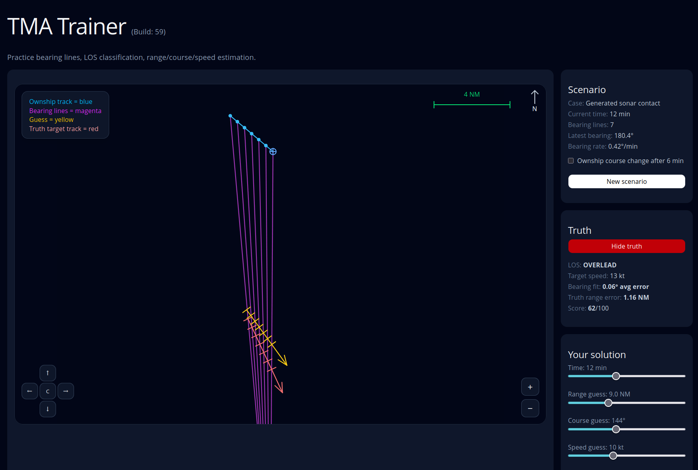

> [!WARNING]
> 
> ## Disclaimer
> 
> This project was created for educational and training purposes only.
> 
> I am not a professional sonar operator, naval officer, or certified expert in Target Motion Analysis (TMA).  
> The geometry, terminology, and workflows implemented in this trainer are based on publicly available information, simulator communities, historical references, and personal research.
> 
> Large parts of the application were developed with assistance from AI tools.  
> As a result, there may be inaccuracies, unrealistic assumptions, implementation mistakes, or simplifications in both the application and the generated scenarios.
> 
> I have not independently verified all referenced concepts, procedures, or documentation used during development.
> 
> The application has primarily been developed and tested on Linux.  
> Windows and macOS compatibility has not been thoroughly verified.
> 
> This project should not be considered an authoritative reference for real-world submarine operations, sonar doctrine, or naval tactics.

# TMA Trainer

TMA Trainer is a lightweight sonar Target Motion Analysis (TMA) training tool inspired by classic submarine simulators and real-world manual plotting workflows.

The application generates synthetic sonar contact scenarios where the player must estimate:

- Target range
- Target course
- Target speed
- Line Of Sound (LOS) geometry

The trainer focuses on visual interpretation of:

- Bearing lines
- Bearing drift
- Relative motion
- Bearing fans
- Manual ruler placement

The goal is not to simulate classified sonar processing systems, but rather to train the analytical geometry and intuition commonly associated with submarine TMA plotting.

---

# What is LOS?

LOS means **Line Of Sound** or **Line Of Sight** depending on context.

In submarine TMA training, LOS normally refers to the geometric relationship between:

- Ownship motion
- Target motion
- Bearing drift over time

The shape of the bearing fan tells you a lot about the target geometry.

## LEAD

In a LEAD situation:

- The bearing lines rotate toward the target's future position
- The target is effectively crossing ahead of ownship
- Bearing drift is moderate and geometrically useful
- This is usually considered favorable TMA geometry

Typical visual indicators:

- Bearing lines intersect ahead of ownship motion
- The fan slowly opens
- Relative motion is stable and analyzable

---

## LAG

In a LAG situation:

- The target crosses behind ownship
- Bearing lines intersect behind the ownship track
- Bearing drift often becomes weaker and harder to solve

Typical indicators:

- Bearing fan points backward relative to ownship movement
- Manual solutions become less stable

---

## OVERLEAD

OVERLEAD occurs when:

- Relative motion becomes nearly parallel
- Bearing drift approaches zero
- Bearing lines become almost parallel

This is generally poor TMA geometry.

Typical indicators:

- Very narrow bearing fan
- Little or no bearing rotation
- Range estimation becomes difficult

Real submarine crews would normally maneuver to improve geometry rather than continue with poor LOS.

---

# Features

The trainer currently supports:

## Scenario generation

- Randomized sonar contact scenarios
- Realistic training ranges
- Controlled bearing drift
- Automatic LOS classification
- Optional ownship maneuver after 6 minutes

## Plotting display

- Bearing line fan visualization
- Ownship track visualization
- Manual target ruler placement
- True target track overlay
- Zoom and panning
- Dynamic scaling

## Training workflow

The intended workflow is:

1. Observe the bearing fan
2. Classify LOS
3. Estimate target range
4. Estimate target course
5. Estimate target speed
6. Compare ruler fit against bearing lines
7. Reveal truth and evaluate solution quality

---

# Controls

## Mouse

| Action      | Description |
| ----------- | ----------- |
| Left drag   | Pan plotter |
| Mouse wheel | Zoom in/out |

## Keyboard

| Key        | Action     |
| ---------- | ---------- |
| WASD       | Pan view   |
| Arrow keys | Pan view   |
| +          | Zoom in    |
| -          | Zoom out   |
| Space      | Reset view |

---

# Running TMA Trainer Locally

The project is a React application.

It can be run locally on:

- Linux
- Windows
- macOS

You only need:

- Node.js
- npm

---

# 1. Install Node.js

Download and install Node.js:

- Node.js 20+ recommended

Official site:

- [https://nodejs.org](https://nodejs.org)

After installation, verify:

```bash
node --version
npm --version
```

---

# 2. Clone the Repository

```bash
git clone https://github.com/Avec112/TMA-trainer.git
cd TMA-trainer 
```

---

# 3. Install Dependencies

Run:

```bash
npm install
```

This downloads all required React dependencies.

---

# 4. Start Development Server

Run:

```bash
npm run dev
```

Most React/Vite setups will then start a local web server.

Typical output:

```text
Local: http://localhost:5173/
```

Open the URL in your browser.

---

# Windows Notes

The commands are identical on Windows.

You can run them from:

- PowerShell
- Windows Terminal
- Command Prompt

Example:

```powershell
npm install
npm run dev
```

---

# Linux Notes

Most Linux distributions already provide Git.

Install Node.js either:

- From your package manager
- Or from the official Node.js binaries

Ubuntu example:

```bash
sudo apt install nodejs npm
```

---

# Recommended Development Environment

Recommended tools:

| Tool          | Purpose                   |
| ------------- | ------------------------- |
| VS Code       | Lightweight React editing |
| IntelliJ IDEA | Full IDE support          |
| Git           | Version control           |
| Node.js       | Runtime                   |

---

# Project Goals

The project aims to:

- Teach manual TMA concepts visually
- Improve understanding of bearing geometry
- Provide realistic but approachable submarine plotting drills
- Avoid arcade-style unrealistic contact geometry

The trainer intentionally constrains:

- Unrealistic target ranges
- Excessive bearing spreads
- Impossible sonar geometries
- Extremely poor plotting situations

This keeps the generated scenarios useful as training exercises.

---

# Current Limitations

The trainer is intentionally simplified.

It currently does not simulate:

- Real acoustic propagation
- Ocean layers
- Thermal effects
- Sensor noise models
- Narrowband analysis
- Broadband classification
- Towed array behavior
- Fire control solutions

The focus is strictly on:

- Relative motion
- Bearing analysis
- Manual TMA geometry

---

# License

- MIT

---

# Acknowledgements

Inspired by:

- Manual submarine TMA procedures
- Classic naval simulators
- Sonar plotting techniques
- Relative motion analysis
